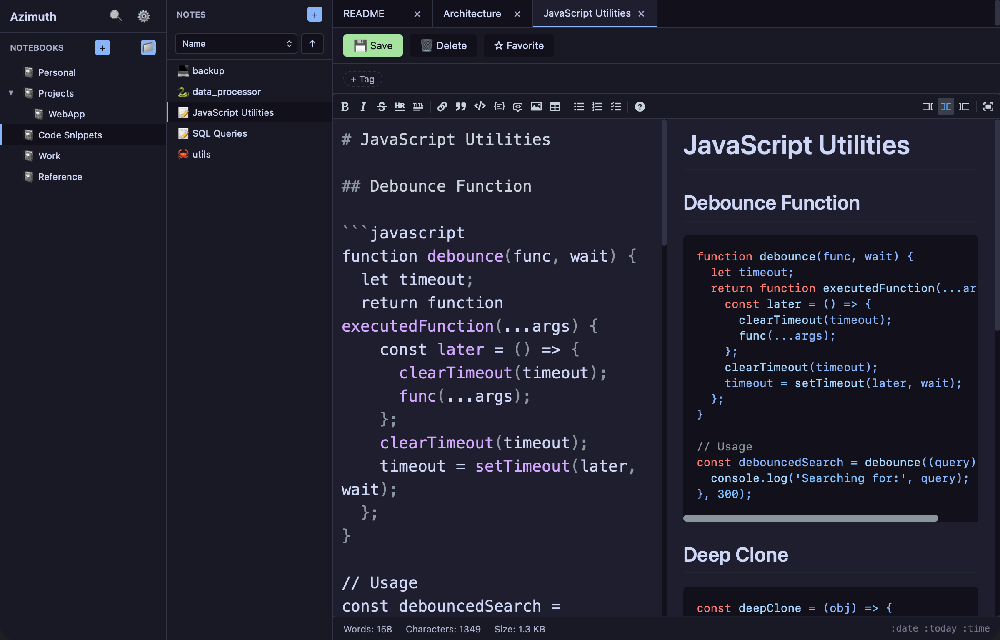

# Azimuth

A modern, cross-platform note-taking application built with Tauri, React, and TypeScript.



## Features

- **Markdown Editor** - Full-featured markdown editing with live preview
- **Notebooks & Folders** - Organize notes in nested notebooks with drag-and-drop support
- **Tabs** - Open multiple notes simultaneously in tabs
- **Search** - Global search across all notes (Cmd+K)
- **Tags** - Tag notes for easy categorization and filtering
- **Favorites** - Star important notes for quick access
- **Customizable Notebooks** - Set custom icons and colors for each notebook (right-click)
- **Cloud Sync** - Sync notes to S3, Dropbox, OneDrive, or Google Drive
- **File Support** - View images, videos, audio, PDFs, and code files
- **Attachments** - Paste or drag images and files into notes
- **Shortcut Commands** - Type `:date`, `:today`, or `:time` to insert timestamps
- **Resizable Panels** - Adjust sidebar and notes list widths
- **Status Bar** - Word count, character count, and file size
- **Sorting** - Sort notes by name, modified date, or created date

## Installation

### Prerequisites

- [Node.js](https://nodejs.org/) (v18+)
- [Rust](https://rustup.rs/)
- [just](https://github.com/casey/just) (optional, for convenience commands)

### Development

```bash
# Install dependencies
npm install

# Run in development mode
npm run tauri dev

# Or using just
just dev
```

### Build

```bash
# Build for production
npm run tauri build

# Or using just
just build
```

## Keyboard Shortcuts

| Shortcut | Action |
|----------|--------|
| Cmd+S | Save note |
| Cmd+K | Search all notes |
| Cmd+P | Command palette |

## Shortcut Commands

Type these in the editor to auto-expand:

| Command | Expands To |
|---------|------------|
| `:date` | Current date and time (YYYY-MM-DD HH:MM) |
| `:today` | Current date (YYYY-MM-DD) |
| `:time` | Current time (HH:MM) |

## Data Storage

Notes are stored locally in `~/Azimuth/`. Each notebook is a folder, and notes are markdown files within those folders.

## Development Commands

```bash
just              # Show available commands
just dev          # Run development server
just build        # Build for production
just check        # Check Rust code
just fmt          # Format Rust code
just clippy       # Lint Rust code
just clean        # Clean build artifacts
just seed         # Create sample content for testing
```

## Tech Stack

- **Frontend**: React 19, TypeScript, Vite
- **Backend**: Tauri 2, Rust
- **Editor**: @uiw/react-md-editor
- **Styling**: Custom CSS with Catppuccin-inspired theme

## License

MIT


---

## Colophon

*Azimuth* — from Arabic *as-sumūt*, meaning "the directions."

In navigation, an azimuth is the angle between a reference direction and a point of interest. Sailors and explorers used azimuth readings to chart courses across uncharted waters, transforming the overwhelming expanse of ocean into a series of manageable bearings.

Notes work the same way. Each thought, each fragment of an idea, is a point in the vast sea of everything you might think or know. Azimuth is the tool that helps you take a bearing on those points — to capture them, organize them, and find your way back to them when you need them most.

The name is a reminder that writing isn't just storage. It's orientation. It's knowing where you are, where you've been, and where you're headed next.
